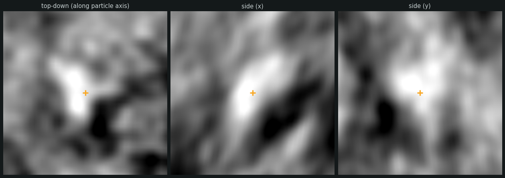
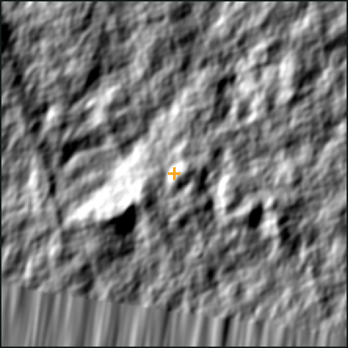

# GPS: Glycoprotein Particle Screening

A command-line tool for rapidly screening particle picks (e.g. from `pytom`) by eye, from a
RELION-style STAR file of particle coordinates/orientations and the tomogram density they were
picked from.

For each particle it renders a real tomogram density slice oriented to that particle's own
orientation (not a membrane normal - this tool does no membrane/segmentation analysis at all), so
picks can be compared side by side in a consistent frame regardless of where or how they sit in the
tomogram.



## Installation

Create a conda environment and `pip install` the package into it:

```bash
conda create -n gps python=3.10
conda activate gps
pip install -e .
```

This installs the `gps` command and its dependencies (`typer`, `mrcfile`, `starfile`, `numpy`, `scipy`,
`pandas`, `flask`, `matplotlib`). Python 3.8+ works; 3.10 is just a safe default. Re-run `pip install -e .`
after pulling new changes, and `conda activate gps` again at the start of every new shell session.

## Usage

`gps` is a two-step, batch-first tool: `prepare` always renders a review image for every particle
found under a directory, and `review` is a strictly separate second step that only ever displays
images `prepare` already rendered - it never renders anything itself. Run `gps --help` to see both
commands.

There is no automatic accept/reject step anywhere in this tool - every particle from every matched
tomogram/starfile pair goes straight into the manual review queue.

### Directory layout

Both commands take one `data_dir` argument, expected to contain these subdirectories, with
matching files (same filename stem, e.g. `ts_028.mrc` / `ts_028.star`) across them treated as one
tomogram:

- `tomograms/` — one tomogram density `.mrc` per tomogram.
- `starfiles/` — one RELION-style particle `.star` file per tomogram, with at least
  `rlnCoordinateX/Y/Z` and `rlnAngleRot`/`rlnAngleTilt`/`rlnAnglePsi` columns. `rlnLCCmax`, if
  present (as in `pytom_match_pick` output), is shown during review but never used to filter.

No `segmentations/` directory is needed - this tool doesn't do any membrane analysis.

### Step 1: `gps prepare`

For each particle, builds its own local orientation frame from `rlnAngleRot`/`rlnAngleTilt`/`rlnAnglePsi`
and renders three orthogonal tomogram density slices in that frame, plus one wider context slice.
Runs across every matched tomogram under `data_dir`, in parallel:

```bash
gps prepare /path/to/data_dir --particles_apx 3.728 --tomo_apx 7.456
```

Pixel sizes are required since the tomogram and particle coordinates are often binned differently.

#### Key options

| Option | Default | What it does |
|---|---|---|
| `--box-size-angstrom` | 300 Å | Width/height of the three close-up panels. |
| `--context-box-size-angstrom` | 2000 Å | Width/height of the two wider panels (context and traditional). |
| `--slab-slices` | 1 (off) | Average this many parallel slices along each panel's own depth axis instead of one slice, to cut noise. |
| `--threshold` | off | Background-suppressing display: blur, then clip so only the top `(100 - threshold)`% of intensity shows at all, everything else flat black. Applies to every panel. |
| `--preview-thresholds` | off | Skip the full render; instead write a quick gallery for `--preview-particles` random particles to `data_dir/gps_threshold_preview/`, each at every threshold from 10 to 90, to pick a `--threshold` value from. |
| `--preview-particles` | 10 | Number of particles sampled for `--preview-thresholds`. |
| `--workers` / `-j` | 4 | Number of tomograms rendered in parallel - they're fully independent of each other. `--workers 1` disables parallelism. |

Run `gps prepare --help` for the full list.

#### Picking a `--threshold`

Raw tomogram slices are often too noisy to easily tell a particle apart from background. Rather
than guess a threshold value, preview a few first:

```bash
gps prepare /path/to/data_dir --particles_apx 3.728 --tomo_apx 7.456 --preview-thresholds
```

This writes one PNG per sampled particle to `data_dir/gps_threshold_preview/` - its side (x) slice
raw, next to itself thresholded at 10, 20, ..., 90 percent - and exits without doing a full render.
Once you've picked a value from those, run the real `gps prepare` with `--threshold <value>` (and
the same `--slab-slices`, if you're using it, so the preview stays representative of the full run).

`--workers` parallelizes across tomograms using Python's `ProcessPoolExecutor`, which only spreads
work across CPU cores on the single machine the command is running on - it cannot reach across
nodes. On a cluster, submit `gps prepare` as a **single-node** job, sized to that node's core count;
requesting multiple SLURM nodes for one invocation will not speed it up, since every node but the
one actually running the process sits idle.

#### Output

One review image per particle is written to `data_dir/gps_review_inputs/<stem>/` (not into
`starfiles/` itself), together with a `records.json` per tomogram that `gps review` reads. This is
the expensive part of the whole tool (tomogram slicing, image rendering), so results are cached per
tomogram, fingerprinted on the input files and the options used - re-running only redoes tomograms
whose inputs or parameters actually changed, so an interrupted batch job can safely be resubmitted.

### Step 2: reviewing results with `gps review`

```bash
gps review /path/to/data_dir
```

Launches a local web app for fast, keyboard-driven manual triage. It only ever reads
`data_dir/gps_review_inputs/` and serves it - it never renders anything itself, and refuses to
start if `gps prepare` hasn't been run yet. Every particle from every prepared tomogram is combined
into a single review queue.

Each particle is shown as three close-up panels in its own frame - a top-down view looking straight
down the particle's own pointing axis, and two side views 90 degrees apart around that axis - next
to two wider panels:

- **context** - oriented the same way as the "side (x)" close-up (i.e. still in the particle's own
  rotated frame), zoomed out to show where on the tomogram the pick sits, e.g. relative to a
  virus/vesicle surface.
- **traditional** - the tomogram's own raw, un-rotated XY slice at the particle's position, the same
  view you'd get scrolling through the tomogram in a standard viewer (IMOD, napari, etc.). Unlike
  every other panel, its orientation doesn't depend on the particle at all, so it looks identical
  across every particle in a tomogram - only where it's centered changes.



Unlike `gps`'s predecessor tool (GCA, which compares a particle's orientation against an
independently-fitted membrane normal), there's no second vector to compare a particle's orientation
against here, so the panels don't *automatically* draw an orientation arrow - the frame itself *is*
the particle's orientation. The point of the close-up views is to let you pattern-match real
particles vs. junk across a consistent, comparable presentation. The only arrows ever shown are the
manual correction annotations described next - a genuinely different thing, drawn by you rather
than derived from an orientation the tool already knows.

#### Manually correcting a particle's orientation

If a particle's pick is right but its orientation looks off, click a base point (on the membrane)
then an apex point (on the particle) in any of the three close-up panels - top-down, side (x),
side (y) - to draw a green base-to-apex vector. Press `enter` to save it and move on; saving a
correction also accepts the particle in the same motion.

You don't need to click all three panels. Each one only pins 2 of the pointing vector's 3
lab-frame components (top-down measures its x/y lean, side (x) measures x/z, side (y) measures
y/z), so a single panel leaves one component undetermined - a real ambiguity, not just imprecision.
Clicking two panels that share an axis (e.g. both side panels share the pointing/z axis) gives two
independent estimates of that shared component, averaged together for a more robust result. If only
one view is legible for a given particle, a single-panel correction is better than none and is
treated the same as any other correction - not flagged as lower-confidence.

top-down is worth clicking too, not just the two side panels: for a badly misoriented particle,
what's labeled "top-down" can end up visually looking like a side view, so it may show the apex
direction more clearly than either of the panels nominally built for that.

A correction only ever changes `rlnAngleRot`/`rlnAngleTilt` (baked into the exported STAR file for
that particle) - `rlnAnglePsi` (in-plane rotation) is left exactly as picked, since nothing in this
click-based workflow constrains it. Corrections persist to
`data_dir/gps_review_inputs/corrections.json` alongside `decisions.json`, and are redrawn on all
three panels whenever you revisit that particle. `z` undoes a correction the same way it undoes a
plain accept/reject.

#### Splitting compute from review on a cluster

Because `gps prepare` never starts a network server, and `gps review` never renders anything, they're
a natural fit for opposite ends of a cluster: run the parallel rendering as a batch job on a compute
node with a high `--workers`, then review on the login node:

```bash
# on a compute node, e.g. inside a Slurm job:
gps prepare /path/to/data_dir --particles_apx 3.728 --tomo_apx 7.456 --workers 32
```

```bash
# on the login node, once the batch job has finished:
gps review /path/to/data_dir
```

Once `gps review` is running:

- Open the printed URL directly, or - if running on a remote cluster - tunnel it first:
  ```bash
  ssh -L 5050:localhost:5050 user@cluster-host
  ```
  then open `http://localhost:5050` locally.
- `enter` accepts the current particle and advances - or, if you've clicked a base/apex annotation
  on any panel (see above), saves that correction and accepts in the same motion; `Backspace`/
  `Delete` rejects (junk) and advances; `←`/`→` navigate without deciding; `z` undoes the last
  decision (or correction).
- Decisions and corrections are saved continuously to `data_dir/gps_review_inputs/decisions.json`
  and `corrections.json`, so a review session can be closed and resumed later without losing
  progress.
- The "Export reviewed STAR files" button writes one `<stem>_reviewed.star` per tomogram
  (accepted particles only) next to that tomogram's input STAR file, with any manually corrected
  `rlnAngleRot`/`rlnAngleTilt` baked in.
